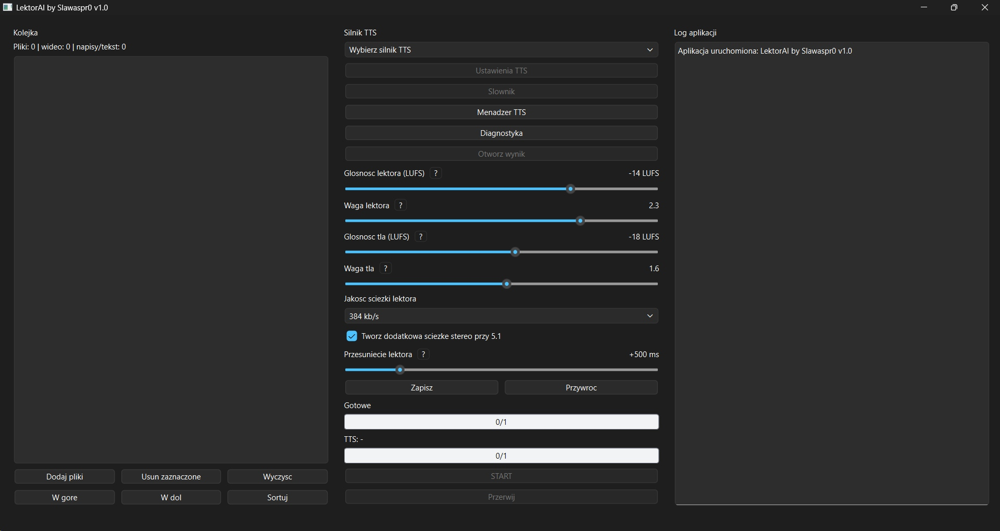

# LektorAI by Slawaspr0



**Wersja: v1.4**

LektorAI by Slawaspr0 to aplikacja do tworzenia polskiej ścieżki lektorskiej dla filmów i seriali. Program korzysta z wybranego silnika TTS, generuje głos lektora na podstawie napisów, składa go w jedną ścieżkę audio, miksuje z oryginalnym tłem filmu i dodaje do wynikowego pliku MKV.

Projekt jest świadomie skupiony na języku polskim. Nie jest tworzony jako uniwersalna, wielojęzyczna platforma TTS. Priorytetem jest polski lektor, poprawna polska wymowa, dobra synchronizacja z napisami i jakość końcowej ścieżki audio.

Projekt jest rozwijany z myślą o jakości lektora, kontroli nad procesem i pracy na wielu silnikach TTS oraz STT bez mieszania ich zależności.

## Funkcje programu

- Pozwala korzystać z wielu silników TTS.
- Pozwala korzystać z wielu silników STT.
- Obsługuje pliki TXT, SRT, audio oraz wideo.
- Posiada kolejkę plików do przetwarzania.
- Na podstawie podanych plików generuje polskiego lektora.
- Niektóre silniki obsługują klonowanie głosu na podstawie próbki lektora.
- Ma narzędzia pomagające poprawić wynik generowania mowy.
- Pozwala użytkownikowi tworzyć własny słownik wymowy.
- Potrafi dodać polską ścieżkę lektora do filmu.
- Potrafi głos w filmie zapisać do postaci napisów.
- Na życzenie potrafi przygotować dodatkową ścieżkę stereo 2.0 ze źródła 5.1.

## Wymagania

### Python

Zalecana wersja:

```text
Python 3.12
```

Podstawowe zależności aplikacji instaluje się komendą:

```powershell
python -m pip install -r requirements.txt
```

### Narzędzia zewnętrzne

Program wymaga następujących bibliotek do działania:

```text
ffmpeg.exe
ffprobe.exe
mkvmerge.exe
```

Aplikacja szuka ich w tej kolejności:

1. w systemowym `PATH`,
2. w folderze aplikacji, obok pliku `START.py`.

### Internet

Internet jest potrzebny dla:

- Edge TTS,
- OpenAI TTS,
- pierwszego pobrania modeli lokalnych,
- instalacji lokalnych silników TTS i STT.

Po pobraniu modeli lokalne silniki mogą działać bez ponownego pobierania danych, o ile ich cache nie zostanie usunięty.

### GPU / CUDA

Lokalne modele TTS i STT mogą korzystać z karty NVIDIA i CUDA. Program ma opcję wyboru urządzenia, np. `auto`, `cpu`, `cuda`, `cuda:0`, `cuda:1`.

Silniki STT uruchamiane na CPU nie wymagają CUDA. Przy użyciu GPU program pobiera potrzebne biblioteki CUDA dla obsługiwanych modułów.

W praktyce:

- `faster-whisper`, Whisper QC i `WhisperX` korzystają ze wspólnej paczki CUDA Runtime pobieranej przez aplikację,
- `whisper.cpp` w wariancie CUDA korzysta z osobnej paczki CUDA Runtime pobieranej przez aplikację,
- do pracy na GPU nadal potrzebna jest karta NVIDIA i aktualny sterownik NVIDIA.

## Uruchomienie

Główny plik startowy aplikacji:

```powershell
python START.py
```

Aplikacja przy pierwszym uruchomieniu utworzy potrzebne pliki konfiguracyjne i foldery robocze. Lokalne silniki TTS i STT można zainstalować później z poziomu programu.

## Silniki TTS i STT

Program jest przygotowany pod modułową obsługę silników TTS i STT.

Aktualne silniki TTS:

- Edge TTS,
- OpenAI TTS,
- Chatterbox,
- OmniVoice,
- Piper TTS,
- Coqui XTTS-v2,
- Supertonic.

Aktualne silniki STT:

- faster-whisper,
- whisper.cpp,
- WhisperX.

Lokalne silniki mają osobne środowiska i osobne foldery. Dzięki temu jeden model nie powinien psuć zależności drugiego modelu.

## Jak przygotować materiał, żeby lektor brzmiał dobrze?

Dwa elementy są najważniejsze:

1. Dobra próbka głosu, jeżeli dany model TTS jej używa.
2. Dobrze przygotowane napisy.

Model TTS czyta dokładnie to, co dostanie. Jeżeli napisy zawierają tagi, śmieci, błędy kodowania, liczby zapisane cyframi albo obce nazwy zapisane niefonetycznie, lektor może brzmieć nienaturalnie.

## Przygotowanie próbki głosu

Jeżeli silnik TTS obsługuje próbkę głosu, próbka powinna być czysta i dobrej jakości.

Unikaj próbek z:

- szumem,
- trzaskami,
- pogłosem,
- muzyką w tle,
- innymi głosami,
- zbyt mocną kompresją,
- nienaturalnie podbitą głośnością.

Jeżeli próbka jest słaba, model często przeniesie jej problemy na wygenerowanego lektora.

## Przygotowanie napisów

W treści napisów powinien zostać tylko tekst, który lektor ma faktycznie wypowiedzieć. Timestampy zostają, ale same kwestie dialogowe warto oczyścić i uprościć.

- Usuń tagi HTML, np.:

  ```text
  <i>, </i>, <b>, </b>
  ```

- Usuń tagi ASS/SSA, np.:

  ```text
  {\an8}, {y:b}, {c:$1130bb}
  ```

- Usuń techniczne znaczniki łamania linii:

  ```text
  \N, \n, \h
  ```

- Usuń nawiasy kwadratowe razem z ich zawartością, jeżeli są opisem dźwięku albo sceny, a nie kwestią dialogową:

  ```text
  [muzyka]
  [śmiech]
  [telefon dzwoni]
  [aplaus]
  [krzyk]
  ```

- Usuń nawiasy zwykłe razem z ich zawartością, jeżeli są tylko opisem technicznym, np. tagiem językowym:

  ```text
  (jap.)
  (niem.)
  (po francusku)
  ```

- Usuń myślniki dialogowe z początku linii:

  ```text
  - Proszę.
  - Dzięki.
  ```

- Usuń etykiety mówców, jeżeli nie mają zostać wypowiedziane:

  ```text
  JAN:
  KOBIETA:
  NARRATOR:
  ```

- Znak `&` usuń albo zamień na `i`, zależnie od kontekstu.

- Wielokropki na końcu kwestii usuń. W środku zdania najlepiej zamień je na przecinek:

  ```text
  Słuchaj, kolego...
  Słuchaj, kolego
  ```

- Usuń zbędne cudzysłowy i apostrofy, jeżeli TTS czyta je nienaturalnie:

  ```text
  „”, “”, ’
  ```

- Liczby zapisuj słownie:

  ```text
  1987 -> tysiąc dziewięćset osiemdziesiąt siedem
  30 -> trzydzieści
  10 minut -> dziesięć minut
  ```

  Pamiętaj o odmianie. W zależności od zdania `10` może oznaczać `dziesięć`, `dziesięciu`, `dziesięcioma` itd.

- Waluty, procenty i promile zapisuj słownie:

  ```text
  $4 -> cztery dolary
  30% -> trzydzieści procent
  2‰ -> dwa promile
  ```

  Tu również ważny jest kontekst. Może być `dolar`, `dolary`, `dolarów`, `procent`, `procenty`, `procentów`.

- Usuń artefakty złego kodowania:

  ```text
  �, Â, Ã, Å, Ĺ, ’
  ```

- Usuń strzałki i symbole ekranowe:

  ```text
  ->, ←, ↑, ↓
  ```

- Usuń nutki i znaczniki muzyki:

  ```text
  ♪, ♫, ♬
  ♪ tekst piosenki ♪
  ```

- Usuń symbole ozdobne:

  ```text
  ★, •, ◆
  ```

- Obce znaki w nazwach, imionach i nazwiskach zamień na wersję fonetyczną zamiast usuwać sam znak:

  ```text
  Céline Dion -> Selin Dion
  señor Lewis -> senior Lewis
  À propos -> a propos
  ```

W dużym skrócie: w tekście napisów powinny zostać polskie słowa, polskie litery, liczby zapisane słownie, nazwy obce zapisane fonetycznie oraz prosta interpunkcja potrzebna do pauz. Tagi, symbole techniczne, opisy dźwięków, śmieci kodowania i znaki, których lektor nie ma wypowiedzieć, powinny zniknąć albo zostać zastąpione czytelnym tekstem.

## Nazwy obce i wymowa

Zagraniczne imiona, nazwiska i nazwy własne warto zapisywać fonetycznie, tak aby polski lektor przeczytał je poprawnie.

Przykłady:

```text
Céline Dion -> Selin Dion
À propos -> a propos
Roger -> Rodżer
Skippy -> Skipi
Grace -> Grejs
Woolbury -> Łulbery
selfie -> selfi
```

Nie usuwaj obcych znaków automatycznie, jeżeli są częścią nazwy. Lepiej zamienić cały wyraz albo nazwę na wersję fonetyczną.

## Interpunkcja

Do sterowania pauzami najlepiej używać głównie:

```text
,
.
```

Wielokropki na końcu kwestii zwykle warto usuwać. W środku zdania można je zamienić na przecinek.

Znaki `?` i `!` mogą zmieniać ekspresję głosu. Jeżeli zależy Ci na spokojnym, stabilnym lektorze, często lepiej zastąpić je kropką albo przecinkiem.

Znaki interpunkcyjne powinny być zapisane bezpośrednio po słowie:

Poprawnie:

```text
Myślałem, że spędzimy razem wieczór
```

Niepoprawnie:

```text
Myślałem , że spędzimy razem wieczór
Myślałem ,że spędzimy razem wieczór
```

## Krótkie kwestie

Niektóre modele TTS źle reagują na bardzo krótkie pojedyncze wypowiedzi. Jeżeli jedna kwestia ma tylko jedno krótkie słowo, a kolejna zaczyna się zaraz po niej, często lepiej je połączyć.

Przykład:

```srt
00:23:23,321 --> 00:23:24,656
Ty

00:23:24,756 --> 00:23:27,175
To ty ukradłeś mi samochód.
```

Można przygotować tak:

```srt
00:23:23,321 --> 00:23:27,175
Ty. To ty ukradłeś mi samochód
```

Dzięki temu model dostaje więcej kontekstu i ma mniejszą szansę na dodanie czegoś od siebie.

## Przykład czyszczenia dialogu

Oryginał:

```text
- Więc to jednak dobry numer.
- Słuchaj, kolego...
```

Po usunięciu myślników:

```text
Więc to jednak dobry numer.
Słuchaj, kolego...
```

Po połączeniu w jedną kwestię:

```text
Więc to jednak dobry numer. Słuchaj, kolego
```

Kropka między zdaniami zostaje jako pauza. Wielokropek na końcu został usunięty.

## Uwagi dla wybranych TTS

### Edge TTS

- Kropka tworzy dłuższą pauzę.
- Przecinek tworzy krótszą pauzę.
- `?` i `!` zachowują się podobnie do kropki.
- Edge dobrze radzi sobie z krótkimi pojedynczymi słowami.
- Jeżeli lektor robi za długie pauzy, warto testowo zamienić część kropek na przecinki.

### Chatterbox

- Kropka tworzy średnią pauzę.
- Przecinek tworzy krótką pauzę.
- Lepiej nie stosować `..` ani `...`, bo reakcja modelu bywa niespójna.
- Model może mieć problem z niektórymi wyrazami zawierającymi `si`, np. `silos`, `seksi`.
- Krótkie pojedyncze słowa mogą powodować halucynacje. Czasem pomaga połączenie krótkiej kwestii z kolejną.

### OmniVoice

- Różnica między przecinkiem a kropką bywa mała.
- Model może mieć problem ze stabilnym respektowaniem pauz.
- Krótkie pojedyncze słowa zwykle czyta poprawnie, ale interpunkcja przy takich słowach może czasem powodować niechciany ogon albo zakłócenie.

## Dobra praktyka

Przed pełnym filmem warto zrobić krótki test na kilku lub kilkunastu minutach materiału. Pozwala to sprawdzić:

- czy wybrany głos brzmi dobrze,
- czy słownik działa poprawnie,
- czy pauzy są naturalne,
- czy głośność lektora i tła jest dobrze ustawiona,
- czy wybrany silnik TTS nie dodaje szumów, trzasków albo losowych słów.

Najlepszy efekt daje połączenie czystych napisów, dobrej próbki głosu, osobnego słownika wymowy i krótkiego testu przed pełną konwersją.

## Podziękowania

Projekt powstał dzięki analizie, testom i inspiracji wieloma rozwiązaniami TTS, STT oraz narzędziami do pracy z lektorem.

Szczególne podziękowania:

- użytkownikowi [gangg111](https://github.com/gangg111) i projektowi [Lektor_AI](https://github.com/gangg111/Lektor_AI/) za inspirację,
- projektowi [Chatterbox TTS](https://github.com/resemble-ai/chatterbox) za silnik TTS wykorzystywany w lokalnym generowaniu głosu,
- projektowi [OmniVoice TTS](https://github.com/k2-fsa/OmniVoice) za silnik TTS wykorzystywany w lokalnym generowaniu głosu,
- projektowi [Piper TTS](https://github.com/OHF-Voice/piper1-gpl) za szybki lokalny silnik TTS,
- projektowi [Coqui XTTS-v2 / Coqui AI TTS](https://github.com/idiap/coqui-ai-TTS) za lokalny silnik TTS z obsługą klonowania głosu,
- projektowi [Supertonic](https://github.com/supertone-inc/supertonic) za lokalny silnik TTS,
- projektowi [faster-whisper](https://github.com/SYSTRAN/faster-whisper) za silnik STT,
- projektowi [whisper.cpp](https://github.com/ggml-org/whisper.cpp) za lokalny silnik STT,
- projektowi [WhisperX](https://github.com/m-bain/whisperX) za silnik STT z dokładniejszym wyrównywaniem timestampów.
